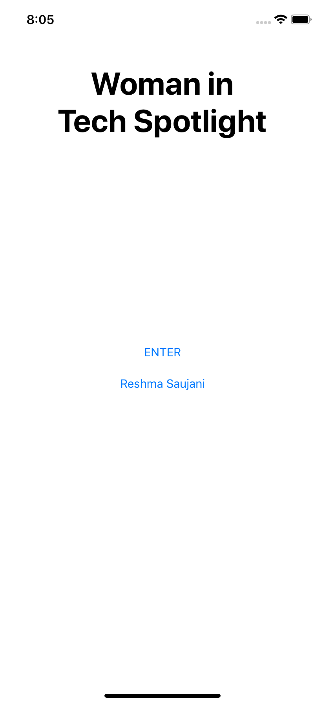
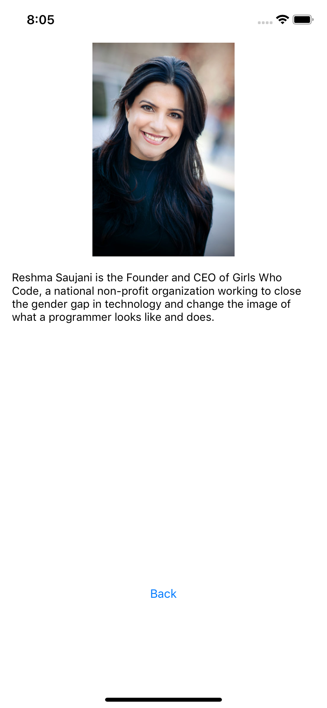

# WomanInTechSpotlight

This was my first IOS app ever. If I had the chance to build the app again (with the same overarching goal), I would use a Table View Controller to list the names of individuals and have another view controller that would display the person clicked description. In my first IOS app, I had planned to hard code each person into their own view controllers. 

